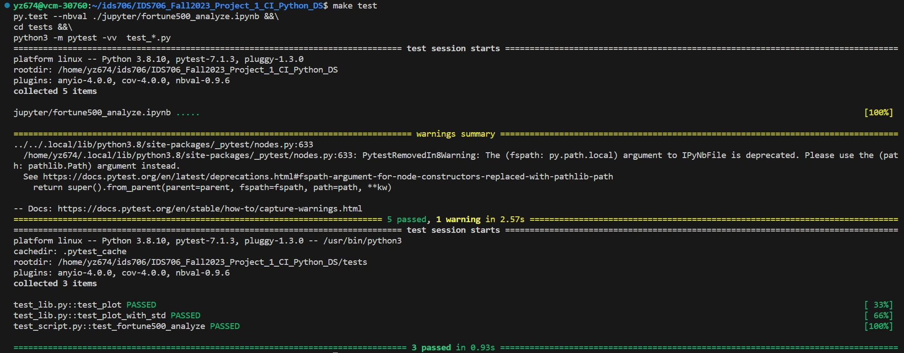
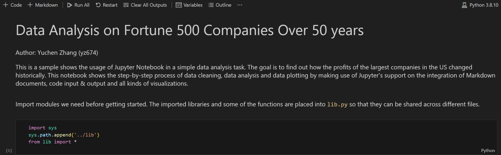
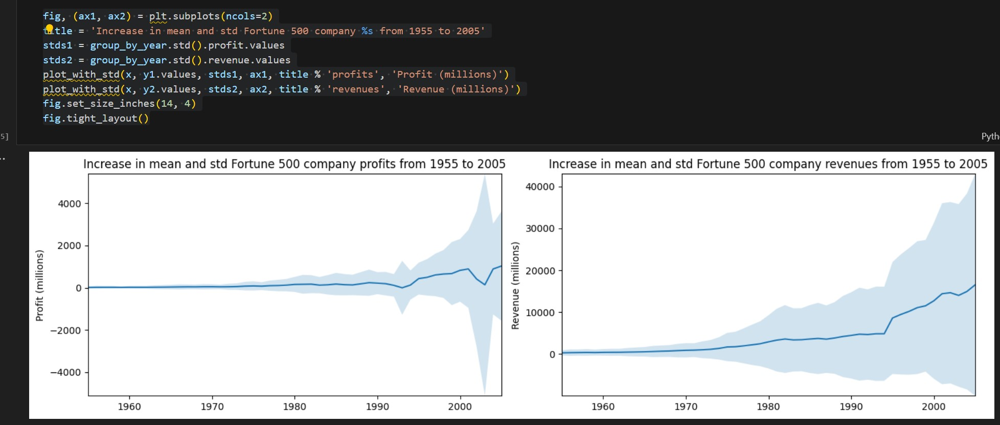

[](https://github.com/nogibjj/IDS706_Fall2023_Project_1_CI_Python_DS/actions/workflows/install.yml)
[](https://github.com/nogibjj/IDS706_Fall2023_Project_1_CI_Python_DS/actions/workflows/format.yml)
[](https://github.com/nogibjj/IDS706_Fall2023_Project_1_CI_Python_DS/actions/workflows/lint.yml)
[](https://github.com/nogibjj/IDS706_Fall2023_Project_1_CI_Python_DS/actions/workflows/test.yml)
# IDS706_Fall2023_Project_1_CI_Python_DS

Fall 2023 IDS_706-Data Engineering Systems Individual Project 1: Continuous Integration using GitHub Actions of Python Data Science Project

### Demo Video On Youtube: https://youtu.be/Df1vYz7Cj1M

It contains:

- ``./jupyter/fortune500_analyze.ipynb``: a Jupyter Notebook that makes use of ``Pandas`` to perform descriptive statistics related to the revenue data of fortune 500 companies over 50 years

- ``./script/fortune500_analyze.py``: a Python script that performs the same descriptive statistics as ``fortune500_analyze.ipynb`` does

- ``./lib/lib.py``: a lib file shares the common code and imported libraries between ``fortune500_analyze.ipynb`` and ``fortune500_analyze.py``

- ``./tests/test_*.py``: unit test files to test script and lib file

- ``Makefile``: defines `install` `format` `lint` `test` actions according to the project requirements

- ``requirements.txt``: includes all the packages needed by the project with pinned version

## How to test

First, manually run Github Actions after cloning the repository to local:
```
make install
make format
make lint
make test
```
If all of those passes, continue to the following steps.


### Jupyter Notebook

Open ``jupyter/fortune500_analyze.ipynb``, the descriptive statistics are shown as an integration of Markdown document and Python code blocks.



You can run each cell separately, or just click ``Run All`` and get all code blocks executed in order. This should generate corresponding plotting for each code block.



### Python Script

First run ``cd ./script/`` to get into the folder, then run ``python3 fortune500_analyze.py``. There should be a `fig.png` plot saved to the same folder, and the output should be the length of dataframe after data cleaning:

